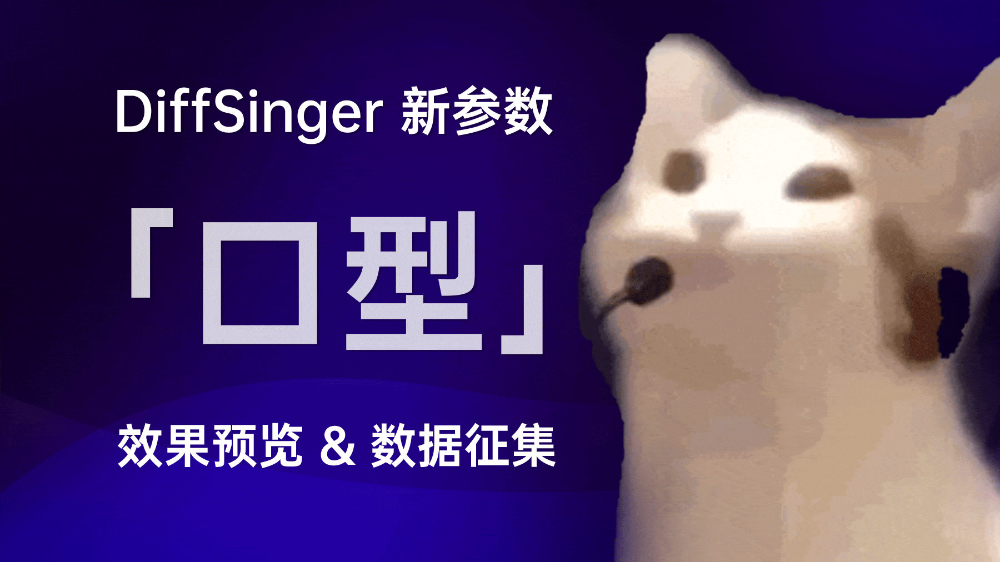

# R^3 - M · O · E

[RecurrentNN × Regression × Regularized] based Mouth Opening Estimation via SSL

[中文文档](https://github.com/KakaruHayate/R3MOE/blob/main/README_CN.md)

## Installation

1. Install PyTorch from official instructions: https://pytorch.org/get-started/locally/
2. Install dependencies:
```bash
pip install -r requirements.txt
```

## Preprocessing

### 1. Mouth Opening Data

1. Collect data using [LipsSync](https://github.com/KCKT0112/LipsSync). Directory structure:
    ```text
    2025-02-04_22-01-52/
        audio.wav
        mouth_data.csv
    2025-02-04_22-43-56/
        audio.wav
        mouth_data.csv
    valid.txt
    ```
    - Prepare seen validation set (in-distribution speakers) and unseen validation set (out-of-distribution speakers)
    - Add audio paths to `valid.txt`
    - For SSL: Prepare unlabeled vocal-only audio (intact spectrum below 16kHz)

2. Run preprocessing:
    ```bash
    # Labeled data
    python recipes/mouth_opening/preprocess.py <SOURCE_DIR> <TARGET_DIR>
    
    # Unlabeled data (SSL)
    python recipes/mouth_opening/preprocess_unlabel.py <SOURCE_DIR> <TARGET_DIR>
    ```

## Base Training

Run training:
```bash
python train.py --exp_name <EXP_NAME> --dataset <DATA_PATH> --gpu <GPU_ID>
```
View all options with `python train.py --help`. Variants:
- `train_r_drop.py` (R-Drop regularization)
- `train_mse.py` (MSE loss)

## SSL Training

Command:
```bash
python train_ssl.py --exp_name <EXP_NAME> --dataset <DATA_PATH> --unlabel_dataset <UNLABEL_PATH> --gpu <GPU_ID>
```
Prerequisites:
- Create `valid2.txt` with unseen validation paths
- `--conv_dropout` must be non-zero

## Recommendations

- Use 10+ hours of seen data
- Prepare 50+ hours of unlabeled data
- Tested datasets: [PopBuTFy](https://drive.google.com/file/d/1IKFp7y1WeYGrwXgJ0HC3rdPj54WoqIsU/view), [M4Singer](https://github.com/M4Singer/M4Singer)

## Inference

(TBD)

## Acknowledgements

- [Mr. Kanru Hua](https://github.com/Sleepwalking)
- Framework cloned from [GeneralCurveEstimator](https://github.com/yqzhishen/GeneralCurveEstimator)
- Training code adapted from [vocal-remover](https://github.com/tsurumeso/vocal-remover)
- Early model reference: [FCPE](https://github.com/CNChTu/FCPE)
- SSL inspiration: [SOFA](https://github.com/qiuqiao/SOFA)
- Core references:
    
  [R-Drop: Regularized Dropout for Neural Networks](https://arxiv.org/abs/2106.14448)
  
  [Temporal Ensembling for Semi-Supervised Learning](https://arxiv.org/abs/1610.02242)
  
  [Mean teachers are better role models: Weight-averaged consistency targets improve semi-supervised deep learning results](https://arxiv.org/abs/1703.01780)

## Resources

- Data collection tool: [LipsSync](https://github.com/KCKT0112/LipsSync)
- Visualization tool: [lips-sync-visualizer](https://github.com/yqzhishen/lips-sync-visualizer)
- .ass mask tools: [mask_fix_tools](https://github.com/KakaruHayate/mask_fix_tools)
- Data expansion initiative: [DiffSinger Discussion](https://github.com/openvpi/DiffSinger/discussions/235)

<div align="center">
  
</div>