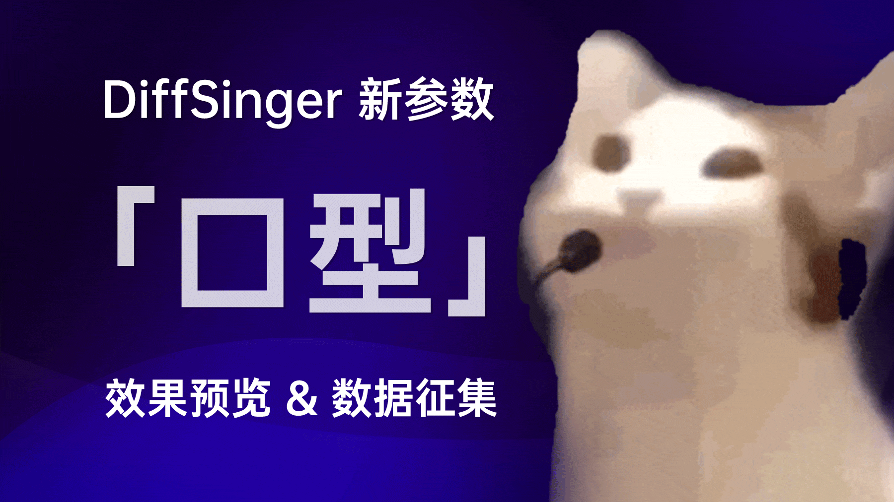

# R^3 - M · O · E

[RecurrentNN × Regression × Regularized] based Mouth Opening Estimation via SSL

[中文文档](https://github.com/KakaruHayate/R3MOE/blob/main/README_CN.md)

## Installation

1. Install PyTorch from official instructions: https://pytorch.org/get-started/locally/
2. Install dependencies:
```bash
pip install -r requirements.txt
```

## Preprocessing

### 1. Mouth Opening Data

1. Collect data using [LipsSync](https://github.com/KCKT0112/LipsSync). Directory structure:
    ```text
    2025-02-04_22-01-52/
        audio.wav
        mouth_data.csv
    2025-02-04_22-43-56/
        audio.wav
        mouth_data.csv
    valid.txt
    ```
    - Prepare seen validation set (in-distribution speakers) and unseen validation set (out-of-distribution speakers)
    - Add audio paths to `valid.txt`
    - For SSL: Prepare unlabeled vocal-only audio (intact spectrum below 16kHz)

2. Run preprocessing:
    ```bash
    # Labeled data
    python recipes/mouth_opening/preprocess.py <SOURCE_DIR> <TARGET_DIR>
    
    # Unlabeled data (SSL)
    python recipes/mouth_opening/preprocess_unlabel.py <SOURCE_DIR> <TARGET_DIR>
    ```

## Base Training

Run training:
```bash
python train.py --exp_name <EXP_NAME> --dataset <DATA_PATH> --gpu <GPU_ID>
```
View all options with `python train.py --help`. 

## SSL Training

Command:
```bash
python train_ssl.py --exp_name <EXP_NAME> --dataset <DATA_PATH> --unlabel_dataset <UNLABEL_PATH> --gpu <GPU_ID>
```
Prerequisites:
- Create `valid2.txt` with unseen validation paths
- `--conv_dropout` must be non-zero

## Recommendations

- Use 10+ hours of seen data
- Prepare 50+ hours of unlabeled data
- Tested datasets:

Labeled:

[mouth opening research project](https://github.com/openvpi/DiffSinger/discussions/235)

MultiModal:

[GRID](https://zenodo.org/records/3625687)

[URSing](https://zenodo.org/records/6404999)

Unlabeled:

[PopBuTFy](https://drive.google.com/file/d/1IKFp7y1WeYGrwXgJ0HC3rdPj54WoqIsU/view) from [NeuralSVB](https://github.com/MoonInTheRiver/NeuralSVB)

[PopCS](https://drive.google.com/file/d/1uFJmPEUWbzguGBdiuupYvYbBEjopN-Xq/view?usp=sharing) from [DiffSinger](https://github.com/MoonInTheRiver/DiffSinger/)

[M4Singer](https://github.com/M4Singer/M4Singer)

[Jingju a Cappella Recordings Collection](https://zenodo.org/records/6536490)

[tiny-singing-voice-database](https://github.com/najeebkhan/tiny-singing-voice-database)

[OpenSinger](https://Multi-Singer.github.io/)

[GTSinger](https://aaronz345.github.io/GTSingerDemo/home)

## Inference

```bash
python eval.py --model <model_path> --wav <wav_path>
```

## Acknowledgements

- [Mr. Kanru Hua](https://github.com/Sleepwalking)
- Framework cloned from [GeneralCurveEstimator](https://github.com/yqzhishen/GeneralCurveEstimator)
- Training code adapted from [vocal-remover](https://github.com/tsurumeso/vocal-remover)
- Early model reference: [FCPE](https://github.com/CNChTu/FCPE)
- SSL inspiration: [SOFA](https://github.com/qiuqiao/SOFA)
- Core references:
    
  [R-Drop: Regularized Dropout for Neural Networks](https://arxiv.org/abs/2106.14448) [[CODE]](https://github.com/dropreg/R-Drop)
  
  [Temporal Ensembling for Semi-Supervised Learning](https://arxiv.org/abs/1610.02242) [[CODE]](https://github.com/ferretj/temporal-ensembling)
  
  [Mean teachers are better role models: Weight-averaged consistency targets improve semi-supervised deep learning results](https://arxiv.org/abs/1703.01780) [[CODE]](https://github.com/CuriousAI/mean-teacher)

- Partial Dataset Reference:
  
  Cooke, M., Barker, J., Cunningham, S., & Shao, X. (2006). The Grid Audio-Visual Speech Corpus (1.0) [Data set]. Zenodo. https://doi.org/10.5281/zenodo.3625687
  
  Bochen Li, Yuxuan Wang, and Zhiyao Duan, Audiovisual singing voice separation, Transactions of the International Society for Music Information Retrieval, 4(1), pp.195–209, 2021. DOI: http://doi.org/10.5334/tismir.108.
  
  Rong Gong, Rafael Caro, Yile Yang, & Xavier Serra. (2022). Jingju a Cappella Recordings Collection (2.0) [Data set]. Zenodo. https://doi.org/10.5281/zenodo.6536490
  
  Zhang, L., Li, R., Wang, S., Deng, L., Liu, J., Ren, Y., He, J., Huang, R., Zhu, J., Chen, X., & Zhao, Z. (2022). M4Singer: A multi-style, multi-singer and musical score provided Mandarin singing corpus [Data set]. Thirty-sixth Conference on Neural Information Processing Systems Datasets and Benchmarks Track.

## Resources

- Data collection tool: [LipsSync](https://github.com/KCKT0112/LipsSync)
- Visualization tool: [lips-sync-visualizer](https://github.com/yqzhishen/lips-sync-visualizer)
- .ass mask tools: [mask_fix_tools](https://github.com/KakaruHayate/mask_fix_tools)
- Data expansion initiative: [DiffSinger Discussion](https://github.com/openvpi/DiffSinger/discussions/235)

<div align="center">
  
</div>
