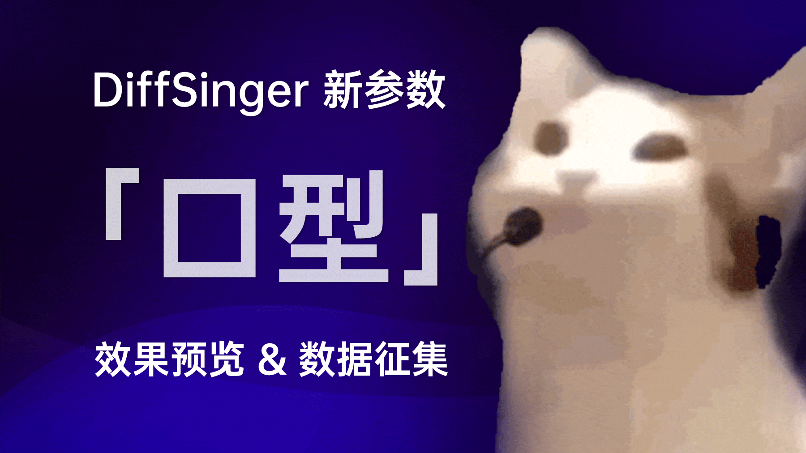

# R^3 - M · O · E

[RecurrentNN × Regression × Regularized] 基础的半监督开口度估计

【循环神经网络 × 回归 × 正则化】

## 安装

1. 根据官方指引安装PyTorch：https://pytorch.org/get-started/locally/
2. 运行以下命令安装依赖：
```bash
pip install -r requirements.txt
```

## 数据预处理

### 1. 开口度数据

1. 使用 [LipsSync](https://github.com/KCKT0112/LipsSync) 采集数据，导出并解压数据。目录结构应如下：
    ```text
    2025-02-04_22-01-52/
        audio.wav
        mouth_data.csv
    2025-02-04_22-43-56/
        audio.wav
        mouth_data.csv
    valid.txt
    ```
    - 需准备seen验证集（含训练集说话人数据）和unseen验证集（不含训练集说话人数据）
    - 将验证集的`audio.wav`相对路径写入`valid.txt`
    - 半监督训练需准备未标注数据，存放纯人声音频（16kHz以下频谱完整）

2. 运行预处理命令：
    ```bash
    # 标注数据处理
    python recipes/mouth_opening/preprocess.py <原始数据目录> <目标目录>
    
    # 未标注数据处理（SSL）
    python recipes/mouth_opening/preprocess_unlabel.py <原始数据目录> <目标目录>
    ```

## 基础训练

运行训练命令：
```bash
python train.py --exp_name <实验名称> --dataset <数据集路径> --gpu <GPU编号>
```
参数说明可通过`python train.py --help`查看。其他变体脚本：
- `train_r_drop.py`（R-Drop正则化）
- `train_mse.py`（MSE损失）

## 半监督训练

运行命令：
```bash
python train_ssl.py --exp_name <实验名称> --dataset <数据集路径> --unlabel_dataset <未标注数据路径> --gpu <GPU编号>
```
准备工作：
- 在数据集路径下创建`valid2.txt`，存放unseen验证集路径
- 必须设置`--conv_dropout`为非零值

## 训练建议

- 推荐使用10+小时seen数据作为驱动数据
- 未标注数据建议准备数十小时
- 我在试验中使用的数据集：[PopBuTFy](https://drive.google.com/file/d/1IKFp7y1WeYGrwXgJ0HC3rdPj54WoqIsU/view) from [NeuralSVB](https://github.com/MoonInTheRiver/NeuralSVB), [PopCS](https://drive.google.com/file/d/1uFJmPEUWbzguGBdiuupYvYbBEjopN-Xq/view?usp=sharing) from [DiffSinger](https://github.com/MoonInTheRiver/DiffSinger/), [M4Singer](https://github.com/M4Singer/M4Singer), [Jingju a Cappella Recordings Collection](https://zenodo.org/records/6536490), [tiny-singing-voice-database](https://github.com/najeebkhan/tiny-singing-voice-database), [OpenSinger](https://Multi-Singer.github.io/), [GTSinger](https://aaronz345.github.io/GTSingerDemo/home)

## 推理

```bash
python eval.py --model <model_path> --wav <wav_path>
```

## 致谢

- [Kanru Hua先生](https://github.com/Sleepwalking)
- 代码框架克隆自 [GeneralCurveEstimator](https://github.com/yqzhishen/GeneralCurveEstimator)
- 训练代码主要改编自 [vocal-remover](https://github.com/tsurumeso/vocal-remover)
- 早期模型参考 [FCPE](https://github.com/CNChTu/FCPE)
- SSL灵感来自 [SOFA](https://github.com/qiuqiao/SOFA)
- 核心算法实现参考：

  [R-Drop: Regularized Dropout for Neural Networks](https://arxiv.org/abs/2106.14448) [[CODE]](https://github.com/dropreg/R-Drop)
  
  [Temporal Ensembling for Semi-Supervised Learning](https://arxiv.org/abs/1610.02242) [[CODE]](https://github.com/ferretj/temporal-ensembling)
  
  [Mean teachers are better role models: Weight-averaged consistency targets improve semi-supervised deep learning results](https://arxiv.org/abs/1703.01780) [[CODE]](https://github.com/CuriousAI/mean-teacher)

## 其他

- 数据采集工具：[LipsSync](https://github.com/KCKT0112/LipsSync)
- 数据可视化工具：[lips-sync-visualizer](https://github.com/yqzhishen/lips-sync-visualizer)
- .ass格式mask工具：[mask_fix_tools](https://github.com/KakaruHayate/mask_fix_tools)
- 数据扩展计划：[DiffSinger讨论区](https://github.com/openvpi/DiffSinger/discussions/235)

<div align="center">
  
</div>
